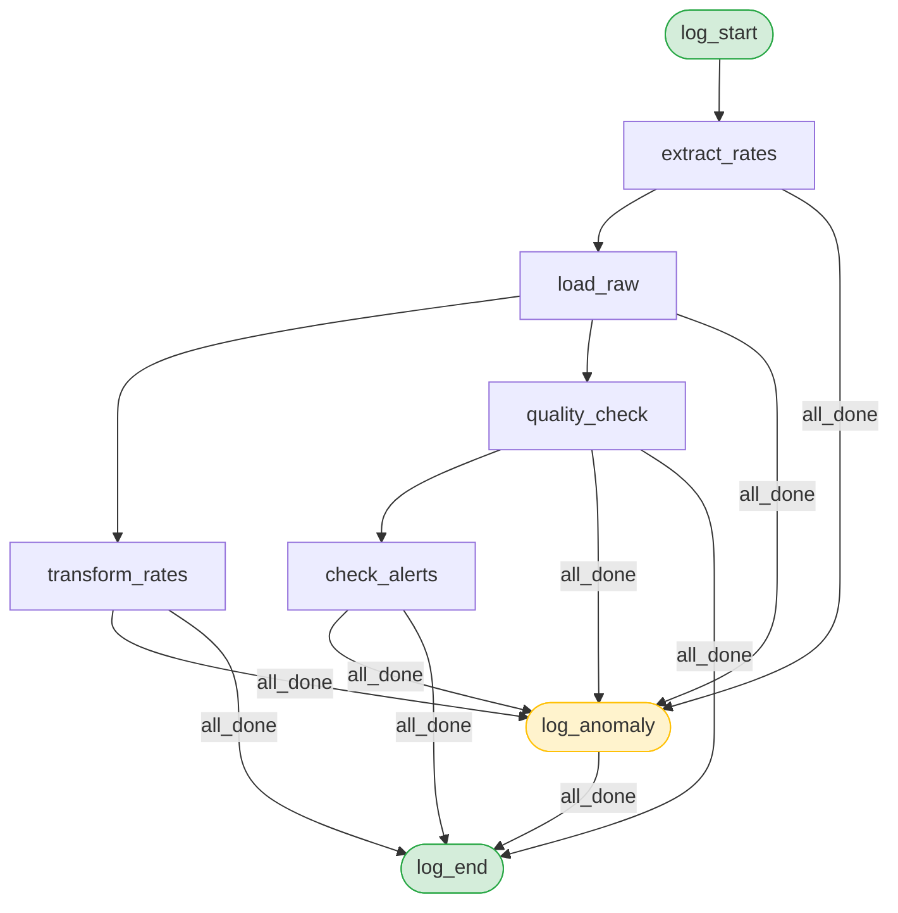

# Suivi des taux de change multi-devises

Pipeline Airflow de récupération, transformation et analyse des taux de change via l'[API Frankfurter](https://www.frankfurter.dev/).

## Présentation

Le pipeline tourne toutes les minutes et effectue les étapes suivantes :

1. **Extraction** — appel à l'API Frankfurter pour récupérer les taux EUR → USD, GBP, JPY, CHF, CAD, AUD
2. **Chargement brut** — sauvegarde de la réponse brute dans `fx.raw_exchange_rates`
3. **Transformation** — normalisation en table structurée `fx.exchange_rates` (1 ligne par paire)
4. **Contrôle qualité** — validation sur 5 dimensions (complétude, structure, cohérence, fraîcheur, unicité) ; les lignes invalides sont archivées dans `fx.rejected_exchange_rates`
5. **Alertes** — détection des variations de taux dépassant un seuil configurable (`fx.alerts`)
6. **Monitoring** — bilan du run écrit dans `fx.ingestion_logs` (statut, compteurs de lignes)

## Prérequis

- [Docker Desktop](https://www.docker.com/products/docker-desktop/) installé et démarré
- [Docker Compose](https://docs.docker.com/compose/) v2+

## Lancement

### 1. Configurer l'environnement

Copier le fichier d'exemple et remplir la clé Fernet :

```bash
cp .env.example .env
```

Générer la clé Fernet (nécessaire au démarrage d'Airflow) :

```bash
docker run --rm apache/airflow:3.2.2 python -c \
  "from cryptography.fernet import Fernet; print(Fernet.generate_key().decode())"
```

Coller la valeur obtenue dans `.env` :

```
FERNET_KEY=<valeur générée>
```

### 2. Démarrer les services

```bash
docker compose up -d
```

La première fois, Docker télécharge les images (~2 Go) et initialise les bases de données. Attendre environ 2 minutes.

### 3. Vérifier que tout est prêt

```bash
docker compose ps
```

Tous les services doivent afficher `healthy` ou `running`.

## Accès

| Service | URL | Identifiants |
|---|---|---|
| Airflow UI | http://localhost:8080 | `airflow` / `airflow` |
| ExchangeDB (PostgreSQL) | `localhost:5433` | `exchange` / `exchange` / db `exchangedb` |

Le DAG `exchange_rates_pipeline` se déclenche automatiquement toutes les minutes.

## Arrêt

```bash
# Arrêter les conteneurs (les données sont conservées)
docker compose down

# Arrêter et supprimer toutes les données
docker compose down -v
```

## Structure du projet

```
.
├── dags/
│   └── dag_exchange_rates.py     # DAG principal
├── plugins/
│   └── exchange_rates/
│       ├── config.py             # Paramètres (devises, API)
│       ├── extract.py            # Appel API Frankfurter
│       ├── load.py               # Insertion en base
│       ├── transform.py          # Normalisation
│       ├── quality.py            # Contrôle qualité (5 dimensions)
│       ├── alerts.py             # Détection de variations anormales
│       └── lifecycle.py          # Logging du cycle de vie du run
├── sql/
│   ├── init_db.sql               # Création du schéma fx et des tables
│   └── kpis_metabase.sql         # Vues analytiques pour Metabase
├── docker-compose.yaml
└── .env.example
```

## DAG — Graphe des tâches



`log_anomaly` et `log_end` utilisent `trigger_rule=all_done` : ils s'exécutent même si une tâche amont a échoué, garantissant qu'un bilan est toujours écrit dans `fx.ingestion_logs`.

## Schéma de données

Toutes les tables sont dans le schéma PostgreSQL `fx` (base `exchangedb`) :

| Table | Description |
|---|---|
| `fx.raw_exchange_rates` | Réponses brutes de l'API |
| `fx.exchange_rates` | Taux normalisés (1 ligne par paire et par date) |
| `fx.rejected_exchange_rates` | Lignes rejetées par le contrôle qualité |
| `fx.alerts` | Variations de taux dépassant le seuil |
| `fx.ingestion_logs` | Bilan de chaque run (statut, compteurs) |

Les vues `fx.vw_taux_moyenne_mobile` et `fx.vw_volatilite_paires` sont prêtes à être connectées à Metabase.
